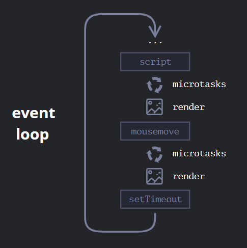

# Conceitos

## Thread
É a forma que um processo/tarefa de um programa é dividido em duas ou mais partes que podem ser executadas simultaneamente.
Cada unidade capaz de executar código é uma thread.

## Maind thread
É onde o navegador processa os eventos de usuário e os renders da tela.
Por default o browser usa single thread para executar javascript, manipular o DOM, calcular layout, renderizar, processar eventos de usuário.
Por isso uma função javascript muito longa pode bloquear a thread e travar o navegador.

## Single thread
Na maior parte dos casos, por default, os browsers são single thread, ou seja, executam uma tarefa do início ao fim antes de iniciar outra tarefa.

## Call stack
Pilha de operações que armazena a sequência de ações que o programa vai executar.
Ele é usado para guardar as execuções futuras de excução do programa seguinto a estrutura de pilha (FILO).
Assim que uma função na call stack é executada, ela já é removida imediatamente.
Ela nos ajuda a saber e acompanhar onde estamos no código para que possamos executar o código em ordem.

## Memory heap
É um grande espaço de memória onde os dados não primitivos são armazenados.

## Event loop
Fluxo de execução do browser, assim como do Node, é baseado no event loop.
É um loop infinito onde a engine do javascript espera por tarefas, executa as tarefas e então dorme aguardando novas tarefas.
Se uma tarefa aparecer quando a engine estiver ocupada, então ela entra na fila. Essa fila de tarefas é chamada de "fila de macrotasks".

## Microtasks
Vem apenas do nosso código.
São criadas normalmente por promises (execução de handlers `.then/catch/finally` se tornam microtasks).
Após a execução de cada Macrotask, a engine executa todas as tarefas de fila de Microtasks antes de executar outra Macrotask ou renderizar algo na tela.

